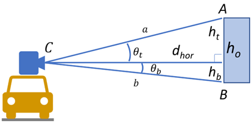
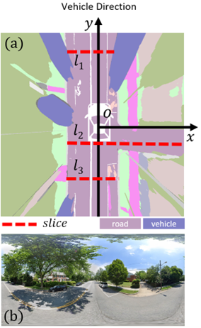
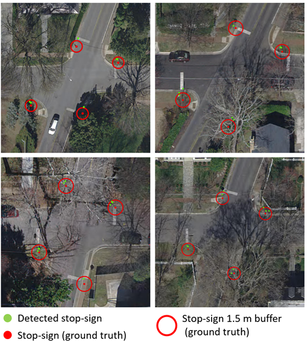
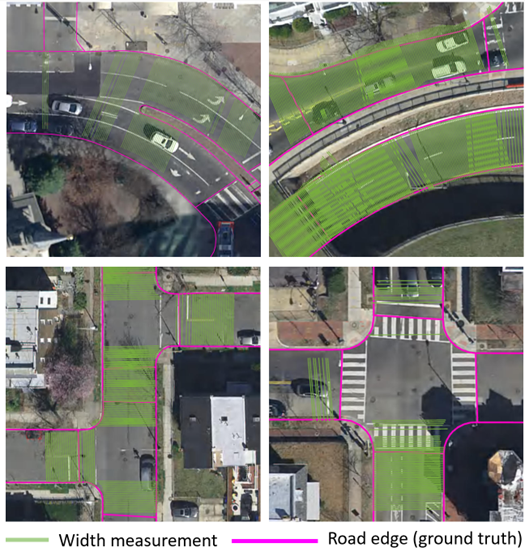

# street_image_mapping

Still being developed, please wait!

Street Image Mapping (or SI_mapping) is a universal framework providing toolkit for localizing and measuring objects in street view images (SVI). SI_mapping can automatically measure the street objects' 3D coordinates or size with appropriate parameters or auxiliary data. The current version of SI_mapping provides two pipelines:
1) [tacheometric surveying](https://en.wikipedia.org/wiki/Tacheometry), i.e., localizing objects which have a known height or width (e.g., stop-sign).
2) width measuring for ribbon objects (e.g., road). 

These two pipelines can be used for vertical and horizontal measuring, respectively. More pipelines, such as triangulation, will be added in the future. 

Below is a notebook to show how to use this framework.

 
Figure 1 explains how the framework conducts tachometry. Panoramas are widely used in SVI services and are stored in equirectangular projection; each pixel's position (e.g., column and row number) represent its orientation. Thus, the street object's altitude angle and azimuth angle originating from the camera can be converted from its column and row number in the panorama. If the object’s distance from the panorama is known, its location can be computed. Our framework implemented the tacheometric method proposed by [Ning et al., (2021)](https://www.tandfonline.com/doi/abs/10.1080/13658816.2021.1981334) to obtain the object distance. 

$AB$ in Figure 1 denotes the object, and its height is knows as $h_o$. Also, Figure 1 illustrates the geometric relationship between $h_o$ the horizontal object distance $d_{hor}$  to the panorama camera $C$, where $\theta_t$ and $\theta_b$ are the altitude angle from $C$ to the object top and bottom respectively. 

The area of the triangle formed by sides $a$, $b$, and $h_o$ can be calculated by $h_o\cdot d_{hor}\cdot0.5$ or $sin\left(\theta_t+\theta_b\right)\cdot a\cdot b\cdot0.5$, so $h_o\cdot d_{hor}=sin\left(\theta_t+\theta_b\right)\cdot a\cdot b$; by plugging in $a=d_{hor}/cos\left(\theta_t\right)$ and $b=d_{hor}/cos\left(\theta_b\right)$, we can have Equation (1) to compute $d_{hor}$. The vertical distance of the object's bottom can be obtained by Equation (2). Therefore, the 3D coordinates of the target objects originating from the panorama camera $C$ can be obtained. For further localization of the target object, the panorama (i.e., $C$) 's coordinate is needed, which is usually provided in its metadata from SVI services.
$$d_{hor}=\frac{h_o⋅cosθ_t⋅cosθb}{sin(θ_t+θ_b)}    \qquad{       (1)}$$ 
$$h_b=tanθ_b·d_{hor}    \qquad{      (2)}$$

Figure 1. Image-based tacheometric surveying

The land cover map in Figure 2a, converted from the panorama in Figure 2b, shows the idea of measuring road widths on the land cover maps ([Ning et al., 2022](https://www.sciencedirect.com/science/article/pii/S0198971522000527)). Other ribbon objects, such as sidewalks or parking strips, can use a similar method. First, a Cartesian coordinate system for each land cover map was established with the $y-axis$ towards the vehicle direction, and then scanlines were generated perpendicularly to the street centerline along with the $y-axis$ (Figure 2a). The interval of scanlines was set to a relatively small value (e.g., 0.25 m) to capture the minor changes in width. We denote the intersection of the scanline and the road surface area as slice. Scanlines usually intersect with the road perpendicularly; thus, the length of a slice is a width measurement of a road segment. The complex urban environment may cause many invalid slices, so we developed a set of algorithms to remove them, for instance, those touching the vehicles (e.g., $l_1$ in Figure 2a) or extending to another road segment (e.g., $l_2$). Only valid slices like $l_3$ are kept.

Figure 2. Road width measurement in a land cover map (a) converted from a panorama (b). The slice $l_1$ touches vehicles while $l_2$ extends to another road segment; both are invalid width measurements and will be ignored. Only $l_3$ will be kept in this example. 

# Case study results

## Stop sign localization

In the study area of Maryland, US, the framework obtained 20,488 measurements for 10,423 (61.7%) stop-signs; compared with the collected dataset, the horizontal RMSE (root-mean-square error) is 2.54 m, the mean error is 1.96 m, and the median error is 1.49 m. For most detected stop-signs (65.9%), they were located close to the actual places within 2 m.

Figure 3. Stop sign localization result examples

## Road width measurement

In the study area of Washingto D.C., the framework generated 35.3 million measurements and 8.0 million of them were valid. To assess their accuracy, we randomly and evenly selected 293 measurements, manually measured their associated actual road width, and then computed the error. The average actual width of the 293 roads is 9.76 m. The RMSE is 1.48 m (or 18.5% in related error), the mean error is 0.85 m (10.0%), and the median is 0.56 m (6.4%). 

Figure 4. Road width measurement examples

# Notes
[GeoPandas](https://geopandas.org/en/stable/) is required for SIM. If you use Windows and have difficulty to install `GeoPandas`, please refer to [this post](https://geoffboeing.com/2014/09/using-geopandas-windows/). Or using the following `conda` command to install:

`conda create -n geo --strict-channel-priority geopandas`
